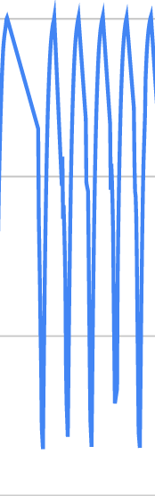

# Pressure analytics

This exercise is in 2 parts: 
1. You have to create 2 functions in `analyze.py`: count_contractions and contractions_per_sec
2. You have to update analyze.py to write a json file and display it on a react webpage

* Notes: Each pressure_*.csv file represents a different pressure curve: time (in ms) VS pressure (in kPa)

## PART 1 - Create 2 analytics functions

### 1. `count_contractions`

This function counts the number of contractions for a given pressure curve

A contraction is valid when the pressure is above 95kPa, then reaches a peak below 85kPa and then reaches a peak again above 95kPa

Here is a visual representation of 5 contractions:



* This function should take in input all the pressure points
* The function should return the total number of contractions for a pressure curve

Example:

```
./analytize.py pressure_1.csv

---
For pressure_1.csv:
* Number of contraction = 76
* Contractions / secs = 0
```

### 2. `contractions_per_sec`

This function gives the mean number of contractions / seconds for a given pressure curve

```
./analytize.py pressure_1.csv

---
For pressure_1.csv:
* Number of contraction = 76
* Contractions / secs = 2.1
```

## PART 2 - Create a web page to visualize the results

### 1. Instead of printing the results to the standard output, update analyze.py so it write the results in a JSON file

The json file should contains the pressure data points, the number of contractions and the number of contractions per seconds

```
./analyze pressure_1.csv
```

```
cat pressure_1.json

{
   "pressure_data": [
      {
        "ms": 48,
        "pressure": 99.7416691868489
      },
      // ...
   ],
   "count_contractions": 76,
   "contraction_per_sec": 2.1
}
   
```

### 2. Display pressure analytics in dashboard/App.js

A react app is already created in the `dashboard/` directory so you don't have to take much time on this part.

/!\ Please keep it simple /!\

This part is totally up to you, you can use all the node modules of your choice (including for the pressure chart) 

#### 2.1 Create a react component called `PressureChart.js`

This component takes the pressure should basically display a chart of the pressure points (time in ms x pressure in kPa)

#### 2.2 Create a react component called `PressureStats.js`

This component should only display the number of contractions and the contraction / s.

Notes:
* A pressure file is directly embedded in App.js.
* You don't have to add css, as long as it's understandable enough
